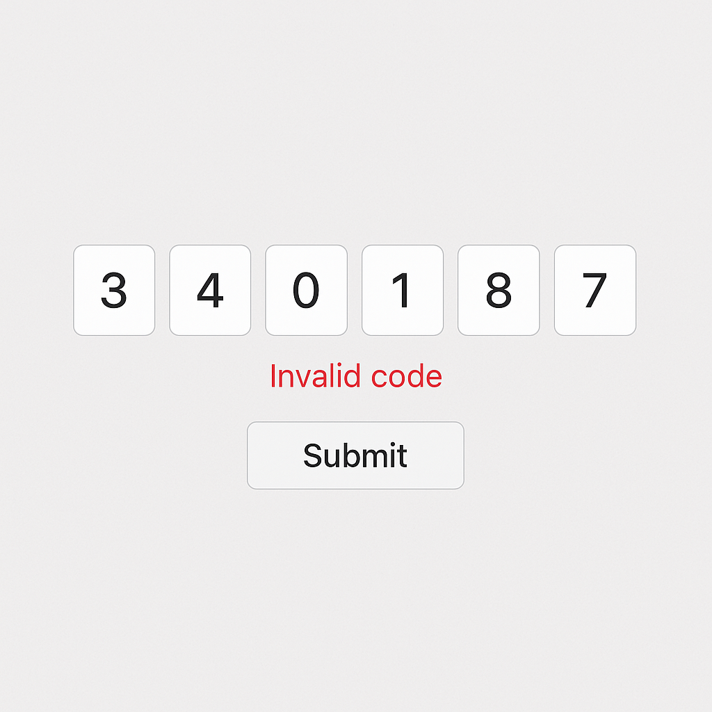

# front-end-interview-2025
Front end interview in 2025

## OTP 組件練習題

此為一個考題練習，需要完成一個 OTP 組件（InputOtp.vue）並且在頁面('/')使用它。

### 預覽圖片



### 功能條件
請將以下功能作為勾選項，核對是否完成：

- [ ] 可支援 4-8 位數字驗證碼（預設 6 位）
- [ ] 輸入數字或是 Tab 後自動跳到下一格
- [ ] 按 Backspace 回到上一格
- [ ] 任何輸入框內可一次貼上完整驗證碼
- [ ] 只允許輸入 0-9 數字
- [ ] 輸入完成時觸發 complete 事件
- [ ] 支援錯誤樣式和訊息顯示
- [ ] 透過API 驗證與處理otp驗證碼：`/api/examples/verify-otp-simple`

### Props

| 屬性 | 說明 | 類型 | 預設值 |
|------|------|------|--------|
| `length` | 驗證碼長度 | Number (4-8) | 6 |
| `error` | 是否顯示錯誤狀態 | Boolean | false |
| `errorMessage` | 自定義錯誤訊息 | String | - |
| `disabled` | 是否禁用組件 | Boolean | false |

### 事件

| 事件名 | 說明 | 參數 |
|--------|------|------|
| `@complete` | 輸入完成時觸發 | 完整驗證碼字串 |


### API 操作說明

#### 題目：`/api/examples/verify-otp-simple`

**請求格式：**
```json
{
  "otp": "123456"
}
```

**參數說明：**
- `otp` (必填): 6 位數字驗證碼字串

**測試案例：**
```bash
# 測試正確的 OTP 驗證碼
curl -X POST http://localhost:3000/api/examples/verify-otp-simple \
  -H "Content-Type: application/json" \
  -d '{"otp": "123456"}'

# 測試錯誤的 OTP 驗證碼
curl -X POST http://localhost:3000/api/examples/verify-otp-simple \
  -H "Content-Type: application/json" \
  -d '{"otp": "654321"}'
```

**成功回傳範例：**
```json
{
  "success": true,
  "data": {
    "verified": true,
    "timestamp": "2025-10-21T08:30:45.123Z"
  }
}
```

**失敗回傳範例：**
```json
{
  "success": false,
  "data": {
    "verified": false,
    "timestamp": "2025-10-21T08:30:45.123Z"
  }
}
```

- 立即回應，無延遲處理
- 任何情況都回傳 200 狀態碼
- 正確驗證碼固定為 `123456`

---


### 環境參考
- node 版本 : `20.13.1`
- yarn 版本 : `1.22.19`
- 編輯器 : `VSCode`

### VSCode 套件參考
- [VS Code](https://code.visualstudio.com/)
- [Tailwind CSS IntelliSense](https://marketplace.visualstudio.com/items?itemName=bradlc.vscode-tailwindcss)
- [Vue 3 Snippets](https://marketplace.visualstudio.com/items?itemName=hollowtree.vue-snippets)
- [Vue - Official](https://marketplace.visualstudio.com/items?itemName=Vue.volar)
- [ESLint](https://marketplace.visualstudio.com/items?itemName=dbaeumer.vscode-eslint)
- [Goto definition alias](https://marketplace.visualstudio.com/items?itemName=antfu.goto-alias)
